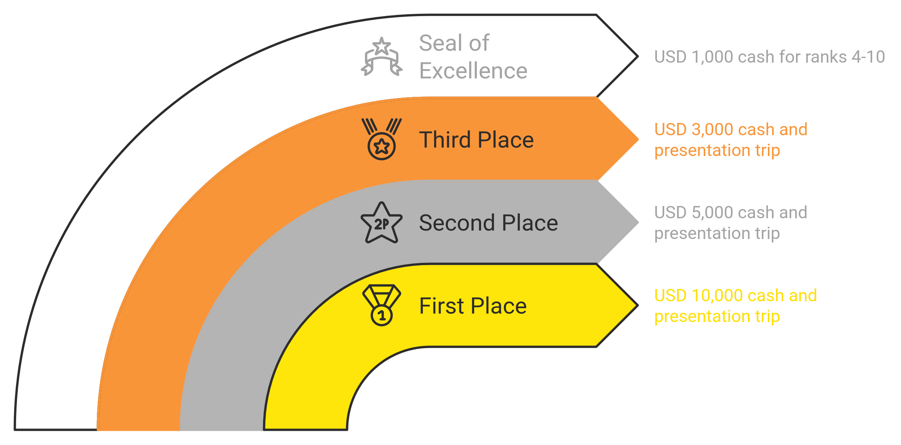
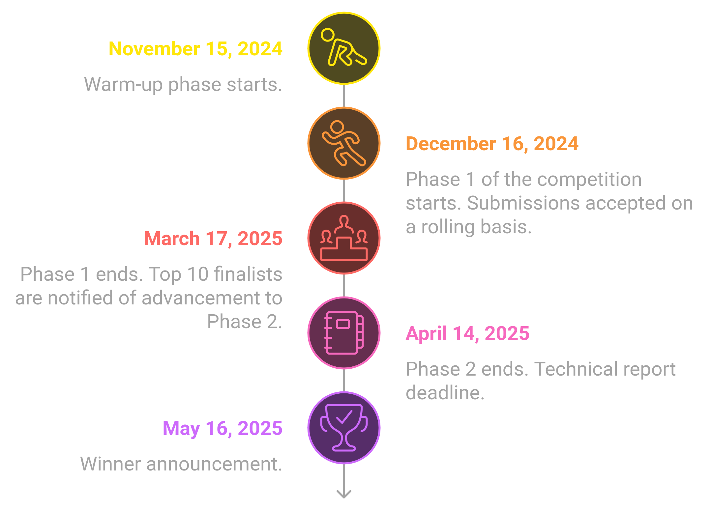

<div align="center">

# STORM-AI
**Satellite Tracking and Orbit Resilience Modeling with AI** 


[![License](https://img.shields.io/badge/License-MIT-921921.svg?logo=data:image/svg+xml;base64,PD94bWwgdmVyc2lvbj0iMS4wIiBzdGFuZGFsb25lPSJubyI/Pgo8IURPQ1RZUEUgc3ZnIFBVQkxJQyAiLS8vVzNDLy9EVEQgU1ZHIDIwMDEwOTA0Ly9FTiIKICJodHRwOi8vd3d3LnczLm9yZy9UUi8yMDAxL1JFQy1TVkctMjAwMTA5MDQvRFREL3N2ZzEwLmR0ZCI+CjxzdmcgdmVyc2lvbj0iMS4wIiB4bWxucz0iaHR0cDovL3d3dy53My5vcmcvMjAwMC9zdmciCiB3aWR0aD0iMjI1LjAwMDAwMHB0IiBoZWlnaHQ9IjIyNS4wMDAwMDBwdCIgdmlld0JveD0iMCAwIDIyNS4wMDAwMDAgMjI1LjAwMDAwMCIKIHByZXNlcnZlQXNwZWN0UmF0aW89InhNaWRZTWlkIG1lZXQiPgoKPGcgdHJhbnNmb3JtPSJ0cmFuc2xhdGUoMC4wMDAwMDAsMjI1LjAwMDAwMCkgc2NhbGUoMC4xMDAwMDAsLTAuMTAwMDAwKSIKZmlsbD0iIzAwMDAwMCIgc3Ryb2tlPSJub25lIj4KPHBhdGggZD0iTTEwNjAgMjI0NCBjLTQwMyAtMzAgLTc0NyAtMjUxIC05MjQgLTU5NCAtOTMgLTE4MCAtMTI2IC0zMTggLTEyNgotNTI1IDAgLTE5NyAzMyAtMzQzIDExNCAtNTA0IDc0IC0xNDggMTkzIC0yOTIgMzI1IC0zOTIgODYgLTY1IDI4NCAtMTYxIDM4NwotMTg4IDIxMiAtNTUgNDc3IC00MyA2NzQgMzAgMzcxIDEzOCA2NDMgNDYwIDcxNiA4NDYgMjUgMTM3IDE2IDM4OCAtMjAgNTA4Ci0xMDkgMzY5IC0zODcgNjU3IC03NDEgNzY4IC0xMjEgMzcgLTI5MSA1OSAtNDA1IDUxeiBtLTUwMCAtMTExOSBsMCAtMzY1IC04MAowIC04MCAwIDAgMzY1IDAgMzY1IDgwIDAgODAgMCAwIC0zNjV6IG0yNjcgMTAwIGMyIC0xNDMgMSAtMjcwIC0yIC0yODIgLTUKLTIyIC0xMSAtMjMgLTg1IC0yMyBsLTgwIDAgMCAyODUgMCAyODYgODMgLTMgODIgLTMgMiAtMjYweiBtMjYzIC0xMDAgbDAKLTM2NSAtODUgMCAtODUgMCAwIDM2NSAwIDM2NSA4NSAwIDg1IDAgMCAtMzY1eiBtMjYwIDI4MCBsMCAtODYgLTgyIDMgLTgzIDMKLTMgODMgLTMgODIgODYgMCA4NSAwIDAgLTg1eiBtNTAwIDAgbDAgLTg1IC0xOTkgMCAtMTk4IDAgLTYgNjMgYy0xMSAxMTUgLTI1CjEwNyAyMDQgMTA3IGwxOTkgMCAwIC04NXogbS01MDAgLTQxMCBsMCAtMjM1IC04NSAwIC04NSAwIDAgMjM1IDAgMjM1IDg1IDAKODUgMCAwIC0yMzV6IG0yNjAgMCBsMCAtMjM1IC04MCAwIC04MCAwIC0yIDE5OCBjLTEgMTA4IC0yIDIxMSAtMyAyMjcgMCAxNyAxCjMzIDMgMzggMiA0IDM5IDcgODMgNyBsNzkgMCAwIC0yMzV6Ii8+CjwvZz4KPC9zdmc+Cg==&labelColor=FFFFFF)]()
[](https://2025-ai-challenge.readthedocs.io/en/latest/?badge=latest)


</div>

---

<div align="center">
<a href="https://2025-ai-challenge.readthedocs.io/en/latest/dataset.html">Dataset</a> • 
<a href="https://2025-ai-challenge.readthedocs.io/en/latest/installation.html">Devkit Installation</a> • 
<a href="https://2025-ai-challenge.readthedocs.io/en/latest/background.html">Background</a> • 
<a href="https://2025-ai-challenge.readthedocs.io/en/latest/baseline.html">Baseline Solutions</a> • 
<a href="https://2025-ai-challenge.readthedocs.io/en/latest/submission.html">Submission Process</a> • 
<a href="https://2025-ai-challenge.readthedocs.io/en/latest/resources.html">Resources</a> • 
<a href="https://2025-ai-challenge.readthedocs.io/en/latest/faq.html">FAQ</a> 


---
<div style="display: flex; justify-content: center; align-items: center; gap: 10px; padding: 10px;">
  <div style="display: inline-flex; align-items: center; background-color: #4d4d4d; color: #ffffff; border-radius: 5px; padding: 5px 10px; font-family: Arial, sans-serif; font-size: 14px; text-align: center;">
      <a href="https://2025-ai-challenge.readthedocs.io/en/latest/README.html" target="_blank" style="color: #ffffff; text-decoration: none;">
        📚 Read The Docs
      </a>
  </div>

  <div style="display: inline-flex; align-items: center; background-color: #4d4d4d; color: #ffffff; border-radius: 5px; padding: 5px 10px; font-family: Arial, sans-serif; font-size: 14px; text-align: center;">
      
      <a href="https://eval.ai/web/challenges/challenge-page/2394/overview" target="_blank" style="color: #ffffff; text-decoration: none;">
      EvalAI Challenge
      </a>
  </div>

  <div style="display: inline-flex; align-items: center; background-color: #4d4d4d; color: #ffffff; border-radius: 5px; padding: 5px 10px; font-family: Arial, sans-serif; font-size: 14px; text-align: center; opacity: 0.5; cursor: not-allowed;">
       
      Article
  </div>
  <div style="display: inline-flex; align-items: center; background-color: #4d4d4d; color: #ffffff; border-radius: 5px; padding: 5px 10px; font-family: Arial, sans-serif; font-size: 14px; text-align: center;">
    <a href="https://github.com/ARCLab-MIT/STORM-AI-devkit-2025/discussions" target="_blank" style="color: #ffffff; text-decoration: none;">
      💬 Discussion Forum
    </a>
</div>
</div>

</div>

---

<div align="left">

<div style="display: flex; flex-direction: column; background-color: #fff4e5; border-left: 6px solid #ffa500; border-radius: 4px; padding: 15px; margin: 20px 0; box-shadow: 0 2px 4px rgba(0, 0, 0, 0.1); font-family: Arial, sans-serif;">
    <div style="font-size: 18px; font-weight: bold; color: #ffffff; background-color: #ffa500; display: inline-block; padding: 5px 10px; border-radius: 3px; margin-bottom: 10px;">🚀  Competition Status</div>
    <p style="font-size: 14px; margin: 0 0 10px; color: #555;">We are currently in <b>Phase 1</b> of the competition, and the <u><a href="
    https://www.dropbox.com/scl/fo/ilxkfy9yla0z2ea97tfqv/AB9lngJ2yHvf9t5h2oQXaDc?rlkey=iju8q5b1kxol78kbt0b9tcfz3&st=j7f0mcc3&dl=0"  
    style="color: #d35400; text-decoration: none; font-weight: bold;">dataset</a></u> has been released. For more information about its content and format, please check out the <u><a href="https://2025-ai-challenge.readthedocs.io/en/latest/dataset.html#dataset-information" style="color: #d35400; text-decoration: none; font-weight: bold;">Dataset Information</a></u> section. You can now submit your code on a rolling basis for evaluation on the <u><a href="https://eval.ai/web/challenges/challenge-page/2394/overview" style="color: #d35400; text-decoration: none; font-weight: bold;">EvalAI platform</a></u>. <b> Phase 1 </b> of the competition will end on March 17, 2025.</p>
    <p style="font-size: 20px; margin: 0 0 10px; color: #555; text-align:center"><b>Have fun!</b></p>
</div>
</div>


<div align="center">

<h3>Competition Overview </h3>

</div>

<div align="justify">

In 2024, solar storms have lit up the skies with stunning Auroras across the United States. But while these displays are captivating to observers on the ground, space weather has the potential to wreak havoc on our global satellite infrastructure. Geomagnetic storms cause rapid heating in Earth’s thermosphere, which can lead to more than a 10x increase in satellite drag in mere hours. In May 2024, the Gannon storm caused the largest mass migration of satellites in history and severely degraded satellite collision avoidance systems worldwide for multiple days ([Parker and Linares, 2024](https://arxiv.org/abs/2406.08617)). This challenge tackles the urgent need for more efficient and accurate tracking and orbit prediction capabilities for resident space objects in the increasingly crowded near-Earth environment. As space activities expand, the demand for advanced technologies to monitor and manage satellite behavior becomes paramount. 

The challenge objective is to develop cutting-edge AI algorithms for nowcasting and forecasting space weather-driven changes in atmospheric density across low earth orbit using historical space weather observations. The available phenomenology include solar and geomagnetic space weather indices, measurements of the interplanetary magnetic field, and measured solar wind parameters. Participants are provided with an existing empirical atmospheric density model and spacecraft accelerometer-derived in situ densities and are tasked with training or creating models to predict future atmospheric density values.
</div>

*Adapted from:*  [](https://arxiv.org/abs/2310.16912)


---

<div align="center">
<h3> Dataset </h3>
</div>

<div align="justify">

You can download the current version of the challenge dataset <a href="https://www.dropbox.com/scl/fo/5pq4kens2baw71p6pr1aq/AFD4xBI92ZN5CHy1cDlJp1E?rlkey=f95tcxwogoro8uel7fowm60x1&st=a091whhb&dl=0">here</a> and view our wiki page for more detailed information about the provided data and how to use it [here](https://2025-ai-challenge.readthedocs.io/en/latest/dataset.html).

The Satellite Tracking and Orbit Resilience Modeling with AI (STORM-AI) dataset contains a collection of historical orbital elements and satellite atmospheric densities, as well as information on magnetic field, plasma, indices, particles, X-Ray flux, and additional derived parameters. All training data is derived from public data sources distributed by organizations that are not affiliated with the AI Challenge, including the ESA, NASA Goddard Space Flight Center, and NOAA. 

The dataset consists of a public challenge dataset that can be used to train and develop AI algorithms and a private evaluation dataset of the same type and format. For valid submissions, algorithm inputs must be limited to the phenomenology and data formats present in the public training dataset, but utilizing additional phenomenology or data sources for model validation and development is allowed and encouraged.

</div>

---
<div align="center">
<h3> Development Toolkit </h3>
</div>

<div align="justify">

The STORM-AI DevKit is accessible on GitHub <a href="https://github.com/ARCLab-MIT/STORM-AI-devkit-2025/">here</a>. It includes the code for the baseline model that appears on the EvalAI leaderboard, a high-fidelity orbit propagator, and more. 

The development kit is coded in Python and includes a set of essential utility functions, tutorials, and baseline implementations designed to help participants get started with the challenge. The tutorials provide guidance on data reading, parsing, and manipulation, as well as on training, evaluating, and submitting the machine learning algorithms to the competition platform.
</div>

---

<div align="center">
<h3> Prizes </h3>
</div>
<div align="justify">
Throughout this challenge, we offer 10 prizes with a total value of USD 25,000 in cash and travel expenses for three presenters to share their results at a technical meeting. Here is the prize breakdown:



* <b> First place*: </b> USD 10,000 in cash and a trip for one team-member to present their results at a technical meeting.
* <b> Second place*: </b> USD 5,000 in cash and a trip for one team-member to present their results at a technical meeting.
* <b> Third place*: </b> USD 3,000 in cash and a trip for one team-member to present their results at a technical meeting.
* <b> Seal of Excellence (4th - 10th)*: </b> USD 1,000 in cash.

  <b> *Terms and conditions: </b> Expenses for travel and accommodations may be reimbursed for one person from each of the first, second, and third place teams. Airfare is reimbursable for economy class and U.S. Flag carrier airlines only. Travelers must submit a budget for approval prior to the trip. Travelers must provide comparison airfare if their trip exceeds the bounds of one day prior to and one day following the designated trip dates. Expenses will be reimbursed after the trip is complete. Cash awards are taxable, and automatic tax withholding will be carried out for nonresidents, while a 1099 will be issued for U.S. residents. Taxes for domestic payments are subject to MIT rules. Taxes for international payments (payments to non-U.S. citizens, including human subjects and recipients of student prizes or awards) are subject to a mandatory 30 percent tax withholding per U.S. government regulations. For some international awards, a reduced cash prize must be awarded due to MIT regulations. All cash prizes will be awarded after the technical meeting. All cash awards are subject to MIT policies and any relevant government policies.
</div>

---

<div align="center">
<h3> Challenge Timeline </h3>
</div>



<!-- 
| Date  | Event | 
| ------------- | ------------- | 
| November 15, 2024 | Warm-up phase starts. |
| December 16, 2024 | Phase 1 of the competition starts. Submissions accepted on a rolling basis. |
| March 17, 2025 |Phase 1 ends. Top 10 finalists are notified of advancement to Phase 2. |
| April 14, 2025 | Phase 2 ends. Technical report deadline. |
| May 16, 2025 | Winner announcement. |
-->

---

<div align="center">
<h3> Citation </h3>
</div>

<div align="left">

The STORM-AI dataset contains multiple data sources and should be credited in accordance with the policies of each data provider linked in the [Dataset](https://2025-ai-challenge.readthedocs.io/en/latest/dataset.html) and [Resources](https://2025-ai-challenge.readthedocs.io/en/latest/resources.html) sections. 

If you reference the 2025 AI challenge problem, please use the following citation:
```bibtex
@article{Briden2023,
  year = {2023},
  month = Sept,
  author = {Julia Briden and Peng Mun Siew and Victor Rodriguez-Fernandez and Richard Linares},
  title = {Transformer-based Atmospheric Density Forecasting},
  journal = {Advanced Maui Optical and Space Surveillance (AMOS) Technologies Conference},
  note = {Free preprint available at [https://arxiv.org/abs/2310.16912](https://arxiv.org/abs/2310.16912)}
}
```
</div>

---

<div align="center">
<h3>Contact Us</h3>
</div>

<div align="left">

You can reach the challenge organizers at ai_challenge@mit.edu.
If you have any questions regarding the devkit, please submit them to the [devkit discussion forum](https://github.com/ARCLab-MIT/STORM-AI-devkit-2025/discussions) on GitHub.

</div>

---

<div align="center">
<h3>Acknowledgement</h3>
</div>

<div align="center">
<i>Research was sponsored by the Department of the Air Force Artificial Intelligence Accelerator and was accomplished under Cooperative Agreement Number FA8750-19-2-1000. The views and conclusions contained in this document are those of the authors and should not be interpreted as representing the official policies, either expressed or implied, of the Department of the Air Force or the U.S. Government. The U.S. Government is authorized to reproduce and distribute reprints for Government purposes notwithstanding any copyright notation herein.

© 2024 Massachusetts Institute of Technology.</i>
</div>

---


