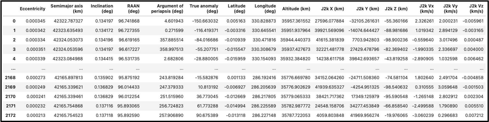

# Dataset Information

## SADSAW Dataset

The Satellite Atmospheric Density and Space Atmospheric Weather (SADSAW) Dataset comprises of a public challenge and private evaluation dataset.

<b>The full public schallenge problem dataset will be made available to participants on December 16, 2024.</b>

### Warmup Dataset 

The [warmup dataset](https://www.dropbox.com/scl/fo/nz1j92xpr6eet3fa5mx5i/ADMYs2zfr3dvxJ-FFd5dmM8?rlkey=tem27v1d2raf2nnlcq6cd49ev&st=sty6ggo3&dl=0) for participants was released on November 15, 2024. 

Participants should use the dataset to become familiar with the competition. The warmup dataset consists of: 
* <b>OMNI2_112613_012420.csv</b>: Space weather information, collected by NASA Space Flight Goddard Center 
* <b>g13_112613_012420.csv</b>: X-Ray flux information, collected by NOAA'S GOES-13 satellite 
* <b>SWARMA_DNS_POD_0012414_012420.csv</b>: ESA'S SWARM A satellite trajectory information with collected atmospheric density values

Your objective is to design a model that, given 60 days of prior space weather and X-Ray flux information, predicts 3 days of future satellite trajectory, as well as future atmospheric density values along that prediction.

That is, your model should take in three kinds of inputs: 
* An initial location for a satellite, represented using orbital elements
* Space weather information, 60 days prior to the timestamp of the initial satellite location
* X-Ray flux information, 60 days prior to the timestamp of the initial satellite location

Your model should then output a prediction of satellite trajectory and atmospheric density values. This prediction must span a period of 3 days following the timestamp of the initial satellite location. 

This explains the starting timestamps in the space weather (OMNI2) and X-Ray flux (G13) information CSV files, which begin 60 days prior to the starting timestamp of the SWARM A data. This also explains the last timestamp in the SWARM A data, which is 3 days past the last timestamp in the OMNI2 and G13 data. 

Some recommendations: 
* You may take the 63-day 'test-case' cycle from anywhere in the provided warmup data files to get familiar with the objective of the competition. 
* We recommend reviewing the Challenge Dataset Description below for more details on the challenge and warmup dataset. This includes exploring the column headers and data type descriptions. 
* Be mindful of dataset units and representations! The warmup data should help get you in this mindset.

### Challenge Dataset Description

SADSAW consists of a public challenge dataset and a private evaluation dataset. The public challenge dataset contains astrometric data and space weather data. 

#### Astrometric Data
The astrometric data contains the measured atmospheric density along the trajectories of multiple satellites, each of the satellites operating with different mission objectives and equipped with different propulsion capabilities. The data is provided at a minimum 1-hour temporal resolution, and consists of the orbital elements, geographic positions, and atmospheric density measures of satellites. The figure below shows a snapshot of example challenge data for a single satellite.

The [warmup dataset](https://www.dropbox.com/scl/fo/5pq4kens2baw71p6pr1aq/AFD4xBI92ZN5CHy1cDlJp1E?rlkey=me1bztt2pmitz8w7ss825scs1&st=jsy8omrb&dl=0) includes an example subsection of this space weather data collected from NASA's OMNI2 satellite, from November 26, 2013 to January 24, 2020. 

TODO: Replace image

A short description of each column header and description in the astrometric data is provided below: 

| Column Header  | Description | 
| ------------- | ------------- | 
| time  | Start of the study period  |
| semi_major_axis | Satellite semi-major axis. Defines the size of the orbit. Represented in | 
| eccentricity | Satellite eccentricity. Describes the shape of the orbit and how stretched it is. Ranges from 0 (perfectly circular) to 1 (parabolic); values greater than 1 indicate a hyperbolic orbit. Units in km for this dataset. | 
| inclination | Satellite inclination. The tilt of the orbit relative to the equatorial plane of the central body; the angle between the orbital plane and the equatorial plane. An inclination of 0° indicates an orbit in the equatorial plane, while 90° represents a polar orbit (crossing over the poles). Units in degrees. |
| right_ascension | Satellite right ascension of the ascending node. Defines horizontal orientation of the orbit; tilt of the orbit relative to the equatorial plane. Units in degrees. |
| arg_periapsis | Satellite argument of periapsis. Specifies the orientation of the orbit within its plane; defines where the orbit’s closest approach occurs within the plane of the orbit. Units in degrees. |
| true_anomaly | Satellite true anomaly. Position of the body along the orbit at a specific time. Units in degrees. |
| density |  Mass density of the atmosphere at satellite altitude; derived from satellite GPS accelerations. Used to calculate aerodynamic drag, which affects orbit decay and may require drift control adjustments. Units in kg/m^3.  |
| density_orbitmean  | Orbit-average of density derived from GPS accelerations. Helps assess long-term drag effects; used to decide if drift control maneuvers are needed due to accumulated orbital decay. Units in kg/m^3. | 
| validity_flag  | Indicator of data quality or reliability. Binary for this dataset; 0 for valid, 1 for invalid or unreliable. |
| altitude  | Satellite altitude. Units in km for this dataset.  | 
| latitude  | Satellite geodetic latitude. Units in degrees.   | 
| longitude  | Satellite geodetic longitude. Units in degrees. |
| local_solar_time | Local solar time at the satellite’s position relative to the Sun. Units in hours for this dataset. |

#### Space Weather Data

In addition, the public challenge dataset contains collected information on amagnetic field, plasma, indices, particles, and several derived parameters provided by the NASA Goddard Space Flight Center. This information gives insight into atmospheric conditions. 

The [warmup data](https://www.dropbox.com/scl/fo/5pq4kens2baw71p6pr1aq/AFD4xBI92ZN5CHy1cDlJp1E?rlkey=me1bztt2pmitz8w7ss825scs1&st=jsy8omrb&dl=0) includes an example subsection of this space weather data collected from NASA's OMNI2 satellite, from November 26, 2013 to January 24, 2020. 

| Column Header              | Description                                                                                           |
|----------------------------|-------------------------------------------------------------------------------------------------------|
| YEAR                       | Year of observation.                                                                                 |
| DOY                        | Day of Year (Julian day) of observation. Ranges 01 to 365.                                           |
| Hour                       | Hour of observation, typically in UTC. Ranges 00 to 23.                                              |
| Bartels_rotation_number    | Number of 27-day solar rotations that have occurred since February 8, 1832.                        |
| ID_for_IMF_spacecraft      | Identifier for spacecraft measuring IMF (Interplanetary Magnetic Field).                  |
| ID_for_SW_Plasma_spacecraft| Identifier for spacecraft measuring Solar Wind Plasma.                                   |
| num_points_IMF_averages    | Number of data points used to calculate IMF averages.                                   |
| num_points_Plasma_averages | Number of data points used to calculate Plasma averages.                               |
| Scalar_B_nT                | Scalar (magnitude) of the magnetic field. Units in nT.                                               |
| Vector_B_Magnitude_nT      | Vector magnitude of the magnetic field. Units in nT.                                                 |
| Lat_Angle_of_B_GSE         | Latitude angle of magnetic field in GSE coordinates. Units in Degrees.                               |
| Long_Angle_of_B_GSE        | Longitude angle of magnetic field in GSE coordinates. Units in Degrees.                              |
| BX_nT_GSE_GSM              | X-component of magnetic field in GSE and GSM coordinates. Units in nT.                               |
| BY_nT_GSE                  | Y-component of magnetic field in GSE coordinates. Units in nT.                                       |
| BZ_nT_GSE                  | Z-component of magnetic field in GSE coordinates. Units in nT.                                       |
| BY_nT_GSM                  | Y-component of magnetic field in GSM coordinates. Units in nT.                                       |
| BZ_nT_GSM                  | Z-component of magnetic field in GSM coordinates. Units in nT.                                       |
| RMS_magnitude_nT           | RMS of magnetic field magnitude. Units in nT.                                                        |
| RMS_field_vector_nT        | RMS of the magnetic field vector. Units in nT.                                                       |
| RMS_BX_GSE_nT              | RMS of BX component in GSE. Units in nT.                                                             |
| RMS_BY_GSE_nT              | RMS of BY component in GSE. Units in nT.                                                             |
| RMS_BZ_GSE_nT              | RMS of BZ component in GSE. Units in nT.                                                             |
| SW_Plasma_Temperature_K    | Solar wind plasma temperature. Units in K.                                                           |
| SW_Proton_Density_N_cm3    | Solar wind proton density. Units in particles/cm³.                                                   |
| SW_Plasma_Speed_km_s       | Solar wind plasma speed. Units in km/s.                                                              |
| SW_Plasma_flow_long_angle  | Longitude angle of solar wind plasma flow. Units in Degrees.                                         |
| SW_Plasma_flow_lat_angle   | Latitude angle of solar wind plasma flow. Units in Degrees.                                          |
| Alpha_Prot_ratio           | Ratio of alpha particles to protons in the solar wind. Units in -.                                   |
| sigma_T_K                  | Standard deviation of solar wind temperature. Units in K.                                            |
| sigma_n_N_cm3              | Standard deviation of proton density. Units in particles/cm³.                                        |
| sigma_V_km_s               | Standard deviation of solar wind speed. Units in km/s.                                               |
| sigma_phi_V_degrees        | Standard deviation of plasma flow longitude angle. Units in Degrees.                                 |
| sigma_theta_V_degrees      | Standard deviation of plasma flow latitude angle. Units in Degrees.                                  |
| sigma_ratio                | Standard deviation ratio. Units in -.                                                                |
| Flow_pressure              | Solar wind flow pressure. Units in nPa.                                                              |
| E_electric_field           | Electric field strength. Units in mV/m.                                                              |
| Plasma_Beta                | Ratio of plasma pressure to magnetic pressure. Units in -.                                           |
| Alfen_mach_number          | Alfvén Mach Number, indicating ratio of solar wind speed to Alfvén speed. Units in -.                |
| Magnetosonic_Mach_number   | Magnetosonic Mach Number, indicating ratio of solar wind speed to magnetosonic speed. Units in -.    |
| Quasy_Invariant            | Quasi-invariant parameter in plasma physics. Units in -.                                             |
| Kp_index                   | Planetary K-index, measuring geomagnetic activity. Units in -.                                       |
| R_Sunspot_No               | Sunspot number, indicating solar activity level. Units in -.                                         |
| Dst_index_nT               | Disturbance Storm Time index. Units in nT.                                                           |
| ap_index_nT                | Ap index, daily averaged planetary geomagnetic index. Units in nT.                                   |
| f10.7_index                | F10.7 Solar radio flux. Units in 10⁻²² W/m²/Hz.                                                      |
| AE_index_nT                | Auroral Electrojet Index, measuring auroral activity strength. Units in nT.                          |
| AL_index_nT                | Auroral Lower Index, measuring lower limit of auroral activity. Units in nT.                         |
| AU_index_nT                | Auroral Upper Index, measuring upper limit of auroral activity. Units in nT.                         |
| pc_index                   | Polar Cap Index, measuring geomagnetic activity in polar regions. Units in -.                        |
| Lyman_alpha                | Lyman-alpha solar flux. Units in W/m².                                                               |
| Proton_flux_>1_Mev         | Proton flux for energies >1 MeV. Units in particles/cm²/s/sr.                                        |
| Proton_flux_>2_Mev         | Proton flux for energies >2 MeV. Units in particles/cm²/s/sr.                                        |
| Proton_flux_>4_Mev         | Proton flux for energies >4 MeV. Units in particles/cm²/s/sr.                                        |
| Proton_flux_>10_Mev        | Proton flux for energies >10 MeV. Units in particles/cm²/s/sr.                                       |
| Proton_flux_>30_Mev        | Proton flux for energies >30 MeV. Units in particles/cm²/s/sr.                                       |
| Proton_flux_>60_Mev        | Proton flux for energies >60 MeV. Units in particles/cm²/s/sr.                                       |
| Flux_FLAG                  | Flag indicating quality of proton flux measurements. Units in -.                                     |
| Date                       | Date of observation. Units in YYYY-MM-DD.                                                            |

#### X-Ray Flux Data

Lastly, the public challenge dataset includes X-Ray flux data collected from NOAA's GOES satellites. The figure below shows a snapshot of this data for a single satellite, GOES-10. 

TODO: Replace image

TODO: fix headers, description-- insert OMNI data headers here
| Type Label  | Description |
| ------------- | ------------- |
| xrsa | Not station-keeping |
| xrsb | Station-keeping using chemical propulsion system |
| EK | Station-keeping using electric propulsion system |
| HK | Station-keeping using hybrid propulsion system |

### Evaluation Dataset 
The private evaluation dataset contains additional data that will be used to evaluate the performance of the participants' models. This private evaluation dataset consists of the trajectories and atmospheric density values of satellites not included in the public challenge dataset.

## Guidelines

Participants should note that algorithm inputs must be limited to the phenomenology and data formats present in the public training dataset, but utilizing additional phenomenology or data sources for model validation and development is allowed and encouraged. 

Also note that since these datasets are collected from real spacecraft, there may be short gaps in the data due to blackout periods and instrument error. Participants should take this into account when designing their algorithms to ensure successful submissions.
