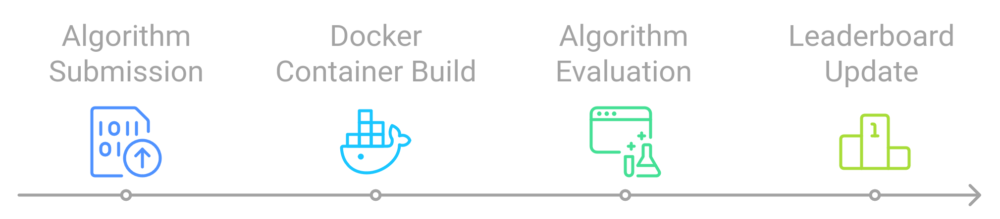

# Submission Tutorial

Participants will be submitting their trained algorithm with their code/workflow to generation predictions into the competition platform, in the programming language they prefer. Here we provide Docker containers and example submissions for Python, but participants are allowed to submit with other custom containers too. The performance of their trained AI algorithm will then be evaluated against our internal test data and evaluation metric on our remote server. Once the evaluation is complete, the results are sent back to the live leaderboard on the challenge platform. This allows for the usage of a private test set, which helps with data privacy concerns and prevents data leakage.

## Details on the Submission Process

Once the competition phase begins, participants will submit their trained algorithms, along with the associated code or workflows, to the competition platform. We will provide Docker containers and example submissions for Python, but you are welcome to use other programming languages by submitting custom containers.

To ensure submissions run smoothly and avoid dependency issues, all participants must include a `Dockerfile` and a `requirements.txt` file in their submission. To simplify the competition phase, we recommend start using Docker during the preparation of your solutions.

Each submission will be evaluated on our remote server using internal test data and a predefined evaluation metric. Once evaluated, results will be updated on the live leaderboard on the challenge platform.



This approach ensures the use of a private test dataset, protecting data privacy and preventing data leakage.


## Prepare code for the submission
### Input data for docker container
The predictions script **must** load data from the `/dataset/test`directory in the docker container.

> Note: `/dataset` is an absolute directory path, mounted on the root directory of the container. It is not a path relative to the current working directory.

The data, as for the training set, is stored in our remote server as separate files with the following directory structure:
```
/
├── dataset                  
    └── test
        ├── GOES                
        |    ├── wu001-goes.csv 
        |    ├── wu002-goes.csv            
        |    └── ...
        ├── OMNI2
        |    ├── wu001-omni2.csv 
        |    ├── wu002-omni2.csv            
        |    └── ... 
        └── initial-states.csv  # Here are the initial states for each test dataset

```

### Required outputs
Your submission has to generate predictions, and save them as a `.json` file.

- The JSON file should be saved to `/submission/submission.json` in the docker container. Note that `/submission` is an absolute directory path, mounted on the root directory of the container. It is not a path relative to the current working directory.
- The output `.json` file shoud have four columns:
    - Timestamp
    - Orbit Mean Density (kg/m^3)

<div style="display: flex; flex-direction: column; background-color: #f9f9f9; border-left: 6px solid #4aa8ec; border-radius: 4px; padding: 15px; margin: 20px 0; box-shadow: 0 2px 4px rgba(0, 0, 0, 0.1); font-family: Arial, sans-serif;">
    <div style="font-size: 18px; font-weight: bold; color: #ffffff; background-color: #4aa8ec; display: inline-block; padding: 5px 10px; border-radius: 3px; margin-bottom: 10px;">ℹ️ Note</div>
    <p style="font-size: 14px; margin: 0; color: #555;">You can check the <a href="https://2025-ai-challenge.readthedocs.io/en/latest/baseline.html">baseline solution</a> to better understand how your submission should be.</p>
</div>

The competition will be hosted on the [EvalAI platform](https://eval.ai/), where you will need to register on the challenge's EvalAI webpage to submit your solutions. While we know you're eager to prepare your models, [here](https://evalai.readthedocs.io/en/latest/participate.html) are some general details to help you get started.

### Test the submission locally
It is strongly recomended that you test run your docker container before making a submission. This will allow you catch any potential bugs you may have in your code.

To test that your Docker container does the right thing, do the following:

#### 1. Prepare dummy version of the test dataset
- Download [this folder](https://www.dropbox.com/scl/fo/e32ku4jr6b57sn3lrr3uu/h?rlkey=tl2074hq994bgpyiv6galr2q1&dl=0) containing small test data (the data used in the warmup phase of the challenge).
- Move it somewhere. We will refer to this path as `LOCAL_DATA_DIR`.
- You should end up with a path that looks like `LOCAL_DATA_DIR/test/`, and directory structure like the one at the begining of this page.

#### 2. Run the container
Open a terminal located in the root folder of your submission files (where your `Dockerfile` should be), and run:
```
docker run --rm\
    --name my-test-submission\
    -v LOCAL_DATA_DIR:/dataset\
    -v LOCAL_PREDICTIONS_DIR:/submission\
    storm-ai-submission 
```

In this command, `LOCAL_DATA_DIR` points to the path where you have extracted the test data, and `LOCAL_PREDICTIONS_DIR` points to the place you want to see the results once the docker container finishes. This command will:
- Mount your local data dir to `/dataset` on the container.
- Mount your local predictions dir to `/submission` on the container.
- Run the entrypoint script you specified in your docker container (e.g. `python -m submission.py` for the [sample Dockerfile](../baseline_submissions/ml_python/Dockerfile) for the Python-based ML baseline).

<div style="display: flex; flex-direction: column; background-color: #f9f9f9; border-left: 6px solid #4aa8ec; border-radius: 4px; padding: 15px; margin: 20px 0; box-shadow: 0 2px 4px rgba(0, 0, 0, 0.1); font-family: Arial, sans-serif;">
    <div style="font-size: 18px; font-weight: bold; color: #ffffff; background-color: #4aa8ec; display: inline-block; padding: 5px 10px; border-radius: 3px; margin-bottom: 10px;">ℹ️ Notes</div>
    <p style="font-size: 14px; margin: 0; color: #555;">
    <b>Note</b>: You can replace the <code>storm-ai-submission</code> with whatever name and tag you used to build the container.
    <br><br>
    <b>Note 2</b>: To test GPU, you will need to install the <a href="https://docs.nvidia.com/datacenter/cloud-native/container-toolkit/install-guide.html"> nvidia-container-toolkit</a>: You will also need to use <code>--gpus all</code> in the call to <code>docker run</code>.
    </p>
</div>


#### 3. Check the outputs
If the above call to `docker run` finished correctly with your submission code, there should be a `LOCAL_PREDICTION_DIR/submission.json`, name that you have used in your submission script to store your results. Open that file and ensure it is structured correctly. Once you do it, you're ready to submit your submission code to our servers! 🎉

## Upload the submission to EvalAI

The platform will guide you through this process when you visit the **Submit** section of the Challenge EvalAI webpage.  
However, we have also prepared a quick tutorial for your convenience.  

### Prepare the environment for uploading submissions
1. Sign up for [the competition on Eval AI](XXX).
2. Install evalai cli tool
    ```bash
    pip install evalai
    ```
<div style="display: flex; flex-direction: column; background-color: #fff4e5; border-left: 6px solid #ff9800; border-radius: 4px; padding: 15px; margin: 20px 0; box-shadow: 0 2px 4px rgba(0, 0, 0, 0.1); font-family: Arial, sans-serif;">
    <div style="font-size: 18px; font-weight: bold; color: #ffffff; background-color: #ff9800; display: inline-block; padding: 5px 10px; border-radius: 3px; margin-bottom: 10px;">⚠️ Attention</div>
    <p style="font-size: 14px; margin: 0; color: #555;">
        If you are encountering issues using or installing the <code>EvalAI CLI Tool</code>, we provide a Docker-based abstraction for it.  
        You can find it <a href="https://github.com/ARCLab-MIT/STORM-AI-devkit-2025/tree/main/evalai_containerization">here</a>, along with all the necessary instructions on how to use it.
    </p>
</div>
    
3. Set your EvalAI authentication token on the cli tool. You can get the token by going to your [eval.ai profile](https://eval.ai/web/profile)
    ```bash
    evalai set_token XXXXXXXXXXXX
    ```

### Push the submission

Open a terminal and run:

```bash
# WARM-UP PHASE
# evalai push MY_DOCKER_IMAGE:MY_TAG --phase warmup-2164
evalai push splid-submission:latest --phase mit-warmup-2394

# COMPETITION PHASE
# evalai push MY_DOCKER_IMAGE:MY_TAG --phase competition-2164
evalai push storm-ai-submission:latest --phase mit-competition-2394
```
<div style="display: flex; flex-direction: column; background-color: #f9f9f9; border-left: 6px solid #4aa8ec; border-radius: 4px; padding: 15px; margin: 20px 0; box-shadow: 0 2px 4px rgba(0, 0, 0, 0.1); font-family: Arial, sans-serif;">
    <div style="font-size: 18px; font-weight: bold; color: #ffffff; background-color: #4aa8ec; display: inline-block; padding: 5px 10px; border-radius: 3px; margin-bottom: 10px;">ℹ️ Notes</div>
    <p style="font-size: 14px; margin: 0; color: #555;">
    Make sure you substitute <code>storm-ai-submission:latest</code> with the actual docker image name and tag you built.
    </p>
</div>


This will upload your docker image to our remote servers, and trigger an evaluation. Note, the first time you submit, it might take a while to upload. Subsequent uploads will be quicker if the base layers of your docker container are the same as the previous submission.

You can now monitor the progress of the submission in the [my submissions](https://eval.ai/web/challenges/challenge-page/2394/my-submission) section in the competition dashboard.


<!--
## Performance Evaluation
Once you have your model running, you can evaluate with the data that you have available. The `evaluation.py` script provides a standard way to assess the performance of the models submitted for the challenge. It employs metrics and evaluation techniques that are aligned with the challenge's objectives.

The toy datasets `ground_truth_toy.csv` and `participant_toy.csv` serve as simplified, example datasets for the challenge. These datasets are intended for initial testing and understanding of the evaluation script and the baseline model.

**Example Usage**
The `run_evaluator` function is the main entry point of the script and accepts the following arguments:

- `participant`: Path to the participant's JSON file.
- `ground_truth`: Path to the ground truth JSON file.
- `plot_object`: Object ID for which to plot evaluation details.

You can also run the script directly from the command line. For example:
```bash
python evaluation.py --participant=participant.json --ground_truth=ground_truth.json
```
This example assumes you have `participant.json` and `ground_truth.json` files in the expected directories. If no arguments are provided, the evaluation will be run for the toy datasets.

**Returns**
The `score` function within the file returns the evaluation metrics as per the challenge guidelines (that is, the F<sub>2</sub> and the RMSE). Additionally, the precision and recall are also returned, and, if the `plot_object` parameter is provided, it generates plots for that specific object ID to aid in understanding the evaluation.
-->

## Important information

Please take note of each of the compatibilty requirements below as they are <b>not</b> subject to change or exception.

### Computational restrictions for submissions
#### Hardware
The submission you make must take the following computational resource limits into consideration and not exceed them.

- **CPU** : 4 cpu cores will be available to you.
- **RAM** : Approx 16Gb of memory will be available.
- **GPU** : 1 GPU, with 16Gb of memory will be available.
- **Run Time** : Your submission should run within approx 10 minutes or less. If submissions take too long to run, they will fail.

#### Software
For maximum compatibility in Python-based submissions, it is recomended to use `python 3.10+``, and pin your python libraries to the following suggested versions (but only if you actually need those libraries).
```
scikit-learn==1.3.2
```
### Steps to create your own Docker image for the submission
<div style="display: flex; flex-direction: column; background-color: #f9f9f9; border-left: 6px solid #008000; border-radius: 4px; padding: 15px; margin: 20px 0; box-shadow: 0 2px 4px rgba(0, 0, 0, 0.1); font-family: Arial, sans-serif;">
    <div style="font-size: 18px; font-weight: bold; color: #ffffff; background-color: #008000; display: inline-block; padding: 5px 10px; border-radius: 3px; margin-bottom: 10px;">🛠️ Code Example</div>
    <p style="font-size: 14px; margin: 0 0 10px; color: #555;">We  provide you with a <code>Dockerfile</code> in the baseline. However, if you are not familiar with this tool, we recommend starting with a very simple <code>Dockerfile</code> in your implementation. Below is a straightforward example, extracted from last year’s challenge:</p>

    <code>
        ####################################
        # EXAMPLE IMAGE FOR PYTHON SUBMISSIONS
        ####################################

        FROM ubuntu:22.04

        # Use this one for submissions that require GPU processing
        # FROM nvidia/cuda:12.1.0-cudnn8-runtime-ubuntu22.04

        RUN apt-get update && \
            DEBIAN_FRONTEND=noninteractive apt-get install -y python3 python3-pip && \
            ln -sf /usr/bin/python3 /usr/bin/python && \
            rm -rf /var/lib/apt/lists/*

        # ADDITIONAL PYTHON DEPENDENCIES (if you have them)
        COPY requirements.txt ./
        RUN pip install -r requirements.txt

        WORKDIR /app
    </code>

</div>


Here are some important considerations to keep in mind when creating your own `Dockerfile`.

#### GPU compatibility
If you want to make use of the GPU resources that are on the cloud infrastructure, then you should use a docker image that contains Nvidia cuda, and cudnn drivers. for example, `nvidia/cuda:12.1.0-cudnn8-runtime-ubuntu22.04`. 

> Note: To use GPU in your container locally, you will need to install the [nvidia container-toolkit](https://docs.nvidia.com/datacenter/cloud-native/container-toolkit/install-guide.html). You will also need to use --gpus all flag with docker.

#### Tips
1. Use `python -m pip install` instead of `pip install` for installing python libraries.

2. Set the `--no-cache-dir` argument when installing python libraries. This keeps docker images smaller.

    ```bash
    # Example
    python -m pip install --no-cache-dir pandas
    ```

3. After installing linux packages, delete the repository cache (this keeps docker images smaller)

    ```bash
    # Exammple of code to delete the apt package cache
    rm -rf /var/lib/apt/lists/*
    ```

4. Only install the bare minimum you need to run predictions. It will keep docker images smaller.
    - During the early stages, you will probably make use of a lot of libraries to perform exploratory analysis. E.g., for visualizing data, creating plots, and exporting images.
    - Do not install all of those libraries on your system onto the Docker image that you submit. 
        - E.g. there is probably no need to be installing `matplotlib` or `plotly` to make predictions.

